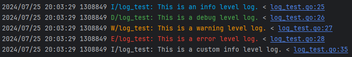
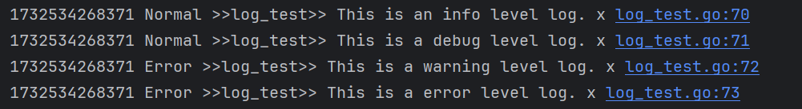

# Pretty Log

[中文](./README.md) | English

A simple and elegant logging library.

## Installation

```shell
go get github.com/l0neman/go-pretty-log
```

```go
import (
    plog "github.com/l0neman/go-pretty-log"
)
```

## Output Logs of Different Levels

```go
// Determine the log tag based on the module
const logTag = "log_test"

// Print using the global logging object
plog.I(logTag, "This is an info level log.")
plog.D(logTag, "This is a debug level log.")
plog.W(logTag, "This is a warning level log.")
plog.E(logTag, "This is an error level log.")
// plog.Fatalln(logTag, "This is a fatal level log.")
// plog.Panicln(logTag, "This is a panic level log.")

// Print using a local logging object
localLogger := plog.NewLogger()
localLogger.SetFlag(plog.FlagStackEnabled)
localLogger.I(logTag, "This is a custom info level log.")
```

```shell
2024/07/25 20:03:29 1308849 I/log_test: This is an info level log. < log_test.go:25
2024/07/25 20:03:29 1308849 D/log_test: This is a debug level log. < log_test.go:26
2024/07/25 20:03:29 1308849 W/log_test: This is a warning level log. < log_test.go:27
2024/07/25 20:03:29 1308849 E/log_test: This is a error level log. < log_test.go:28
2024/07/25 20:03:29 1308849 I/log_test: This is a custom info level log. < log_test.go:35
```

- Set Output Level

```go
// Set only warn and error level logs to be output
plog.SetLevel(plog.LevelWarn | plog.LevelError)
```

- Enable color (cannot guarantee all terminals support it)

```go
plog.SetFlag(plog.FlagColorEnabled)
```



## Custom Printer

```go
// Printer custom output
type Printer struct {
    // If you only want to process the logs, you can keep the default implementation
    plog.Printer
}

func (p *Printer) Print(time time.Time, level plog.Level, logTag, logContent string, pid int, colorful bool,
stackInfo string) {

    levelTag := "Normal"
    if level >= plog.LevelWarn {
        levelTag = "Error"
    }

    // 1732532821260 Error >>log_test>> This is a warning level log. x log_test.go:43
    fmt.Printf("%d %s >>%s>> %s x %s", time.UnixMilli(), levelTag, logTag, logContent, stackInfo)

    // Call default implementation
    // p.Printer.Print(time, level, logTag, logContent, pid, colorful, stackInfo)
}

func NewPrinter() *Printer {
    return &Printer{plog.NewPrinter()}
}

// Custom printer
plog.GlobalLogger().SetPrinter(NewPrinter())

plog.I(logTag, "This is an info level log.")
plog.D(logTag, "This is a debug level log.")
plog.W(logTag, "This is a warning level log.")
plog.E(logTag, "This is an error level log.")
```



## Log Utilities

### Output Eye-catching Highlighted Information

```go
fmt.Println("--== TestHighlightLine ==--")
fmt.Println(highlignt.GetLine("Welcome to V1.0 System", 30))

lines := []string{"Welcome to V1.0 System", "Running..."}
fmt.Println(highlignt.GetLines(lines, 25))
```

```shell
┏━━━━━━━━━━━━━━━━━━━━━━━━━━━━━
┃ Welcome to V1.0 System
┗━━━━━━━━━━━━━━━━━━━━━━━━━━━━━

┏━━━━━━━━━━━━━━━━━━━━━━━━
┃ Welcome to V1.0 System
┃ Running...
┗━━━━━━━━━━━━━━━━━━━━━━━━
```

### Output Table

Chinese is not supported because alignment cannot be guaranteed.

```go
// Get table directly
content := [][]interface{}{
    {"Name", "Age", "City", "High"},
    {"Alice", 25, "Beijing", "170cm"},
    {"Bob", 30, "San Francisco", "180cm"},
}

fmt.Println(plog.GetHorizontalPrettyTable(content))

// With a name
fmt.Println(plog.GetHorizontalPrettyTableWithName(content, "Members"))
```

```shell
┌──────────────────────────────────┐
│ Name   Age  City           High  │
│ ─────  ───  ─────────────  ───── │
│ Alice  25   Beijing        170cm │
│ Bob    30   San Francisco  180cm │
└──────────────────────────────────┘
┌──────────────────────────────────┐
│ Members                          │
├──────────────────────────────────┤
│ Name   Age  City           High  │
│ ─────  ───  ─────────────  ───── │
│ Alice  25   Beijing        170cm │
│ Bob    30   San Francisco  180cm │
└──────────────────────────────────┘
```

Output a horizontal table by creating an object.

```go
// Record table row by row, retrieve it altogether
prettyTable := plog.NewPrettyTable()
prettyTable.SetGravity(plog.GravityHorizontal)
prettyTable.SetTableName("Members")
prettyTable.SetTitles("Name", "Age", "City", "High")
prettyTable.AddValues("Alice", 25, "Beijing", "170cm")
prettyTable.AddValues("Bob", 30, "San Francisco", "180cm")
fmt.Println(prettyTable.Get())
```

```shell
┌──────────────────────────────────┐
│ Members                          │
├──────────────────────────────────┤
│ Name   Age  City           High  │
│ ─────  ───  ─────────────  ───── │
│ Alice  25   Beijing        170cm │
│ Bob    30   San Francisco  180cm │
└──────────────────────────────────┘
```

If the table has too many columns, causing word wrap, you can choose to output a vertical table.

```go
// Vertical table
verticalTable := plog.NewPrettyTable()
verticalTable.SetGravity(plog.GravityVertical)
verticalTable.SetTableName("Members")
verticalTable.SetTitles("Name", "Age", "City", "High")
verticalTable.AddValues("Alice", 25, "Beijing", "170cm")
verticalTable.AddValues("Bob", 30, "San Francisco", "180cm")
fmt.Println(verticalTable.Get())
```

```shell
┌────────────────────╼
│       Members       
├────────[ 0 ]───────┈
│ Name: Alice
│  Age: 25
│ City: Beijing
│ High: 170cm
├────────[ 1 ]───────┈
│ Name: Bob
│  Age: 30
│ City: San Francisco
│ High: 180cm
└────────────────────╼
```
